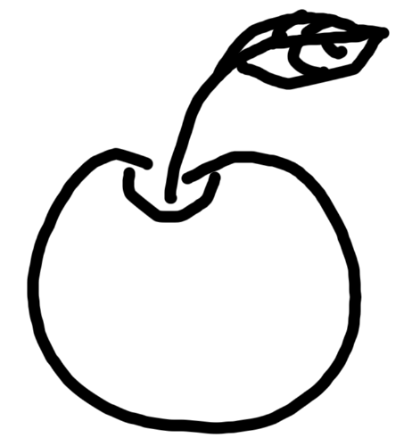
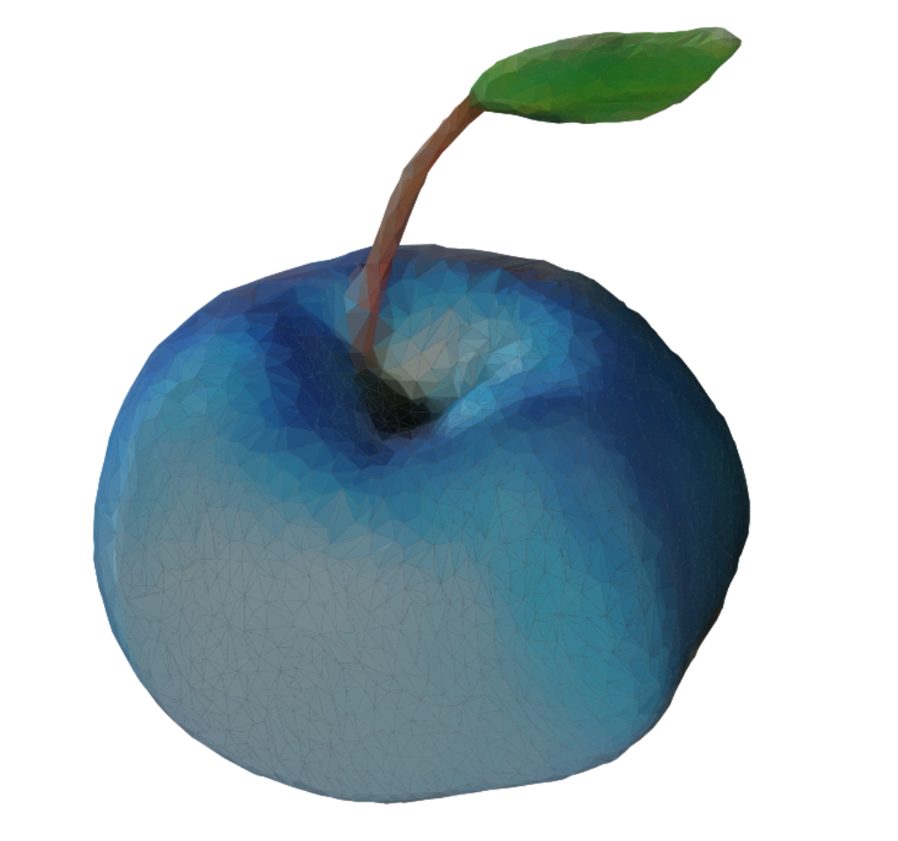
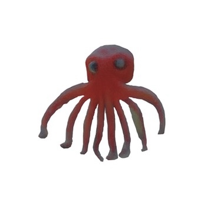
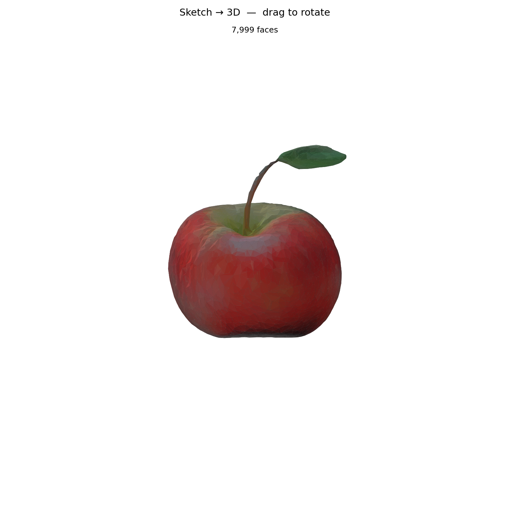
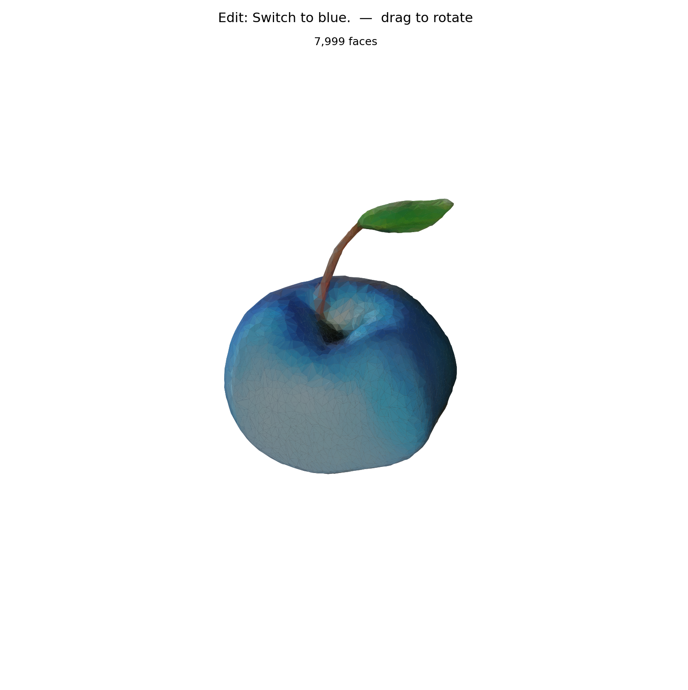

# Deep Learning Final Assignment

Sketch-to-3D foundation model demo: draw a sketch and get a 3D mesh using a multi-model pipeline.

```text
sketch image
→ Qwen prompt generation
→ ControlNet Scribble image generation
→ rembg foreground extraction
→ Qwen image validation / prompt refinement
→ TripoSR mesh reconstruction
→ interactive mesh viewer
```

<table align="center">
  <tr>
    <td align="center"></td>
    <td align="center"><b>→</b></td>
    <td align="center"></td>
    <td align="center"></td>
    <td align="center"><b>→</b></td>
    <td align="center"></td>
  </tr>
  <tr>
    <td colspan="3" align="center"><sub>apple</sub></td>
    <td colspan="3" align="center"><sub>octopus</sub></td>
  </tr>
</table>

<br>

A lightweight **sketch → image → mesh** pipeline designed to run on local hardware (Apple MPS, CUDA, or CPU) without multi-view capture or a GPU server.

- **Qwen3.5-0.8B** infers the object and fills in physical attributes (color, material, texture) not visible in the sketch
- **ControlNet Scribble** generates an image that follows the user's stroke structure
- **TripoSR** reconstructs a 3D mesh from that single image

## Setup

```bash
git clone https://github.com/junwon0901/foundation-models-final.git
cd foundation-models-final
```

Using venv:

```bash
python -m venv .venv
source .venv/bin/activate  # Windows: .venv\Scripts\activate
pip install -r requirement.txt
```

For CUDA, install the matching PyTorch build from the official PyTorch site first, then run `pip install -r requirement.txt`.

## Run

```bash
python demo.py samples/sample_01.png
```

Useful options:

```bash
python demo.py samples/sample_01.png --device cuda
python demo.py samples/sample_01.png --device mps
python demo.py samples/sample_01.png --no-viewer
```

After the mesh is shown, type an edit prompt in the terminal and press Enter. Press Enter on an empty line to stop.

## Example Session

```text
$ python demo.py samples/sample_01.png --device mps

  Input sketch: samples/sample_01.png
  Output dir: demo_outputs/01
  Device: mps

[1] Qwen prompt generation
  Loading Qwen model: Qwen/Qwen3.5-0.8B on mps
  done in 13.3s
  [1] Prompt -> demo_outputs/01/01_qwen_controlnet_prompt.txt
  red apple, natural skin texture, small stem with leaf, isometric view, no background
  Loading ControlNet: lllyasviel/sd-controlnet-scribble
  Preparing ControlNet scribble image

[2] ControlNet (attempt 1) (10 steps)
  done in 19.3s

[3] Background removal
  done in 8.6s

[4] Qwen image evaluation (attempt 1)
  Loading Qwen model: Qwen/Qwen3.5-0.8B on mps
  done in 14.0s
  ✓ image OK
  ControlNet foreground accepted in memory

[5] TripoSR 3D reconstruction (res=256)
    Raw mesh: 75275 verts, 150232 faces
    Decimating: 150232 → 10000 faces
    File mesh : 5011 verts, 10000 faces → demo_outputs/01/03_mesh.obj
    Decimating: 150232 → 8000 faces
    View mesh : 4005 verts, 7999 faces (for interactive viewer)
  done in 9.2s

Total elapsed: 1m 12.5s

Edit (press Enter to quit)
▶ 파란색으로 변경해 줘.
  Loading translator: Helsinki-NLP/opus-mt-ko-en
    Translated: Switch to blue.

[1] Qwen prompt rewrite
  Loading Qwen model: Qwen/Qwen3.5-0.8B on mps
  done in 11.6s
  blue apple, natural skin texture, small stem with leaf, isometric view, no background
  Loading ControlNet: lllyasviel/sd-controlnet-scribble
  Preparing ControlNet scribble image

[2] ControlNet (attempt 1) (10 steps)
  done in 20.0s

[3] Background removal
  done in 7.1s

[4] Qwen image evaluation (attempt 1)
  Loading Qwen model: Qwen/Qwen3.5-0.8B on mps
  done in 13.5s
  ✓ image OK

[5] TripoSR 3D reconstruction (res=256)
    Raw mesh: 56770 verts, 113344 faces
    Decimating: 113344 → 10000 faces
    File mesh : 5003 verts, 9999 faces → demo_outputs/01/03_mesh.obj
    Decimating: 113344 → 8000 faces
    View mesh : 4002 verts, 7999 faces (for interactive viewer)
  done in 9.2s

Total elapsed: 1m 12.8s

Edit (press Enter to quit)
▶ 
```

## Results

```text
Sketch  →  [Qwen] prompt  →  [ControlNet] image  →  [rembg] foreground  →  [Qwen] validate  →  [TripoSR] mesh
```

<table align="center">
  <tr>
    <th align="center">Sketch</th>
    <th align="center">Qwen Prompt</th>
    <th align="center">ControlNet Output</th>
    <th align="center">3D Mesh</th>
  </tr>
  <tr>
    <td align="center" rowspan="2"></td>
    <td><code>red apple, natural skin texture,<br>small stem with leaf,<br>isometric view, no background</code></td>
    <td align="center"></td>
    <td align="center"></td>
  </tr>
  <tr>
    <td>
      <sub>✏ edit: "파란색으로 변경해 줘." → Switch to blue.</sub><br><br>
      <code>blue apple, natural skin texture,<br>small stem with leaf,<br>isometric view, no background</code>
    </td>
    <td align="center"></td>
    <td align="center"></td>
  </tr>
</table>

## Models

| Stage | Model |
|---|---|
| Prompt generation / validation | `Qwen/Qwen3.5-0.8B` |
| Image generation | `runwayml/stable-diffusion-v1-5` |
| ControlNet | `lllyasviel/sd-controlnet-scribble` |
| Background removal | `rembg` with `birefnet-general` |
| 3D reconstruction | `stabilityai/TripoSR` |

## Outputs

Each run writes to a numbered directory under `demo_outputs/`:

- `00_input_sketch.png`
- `01_qwen_controlnet_prompt.txt`
- `02_control_scribble.png`
- `02_controlnet_image_raw.png`
- `03_triposr_input.png`
- `03_mesh.obj`

Generated outputs are ignored by git.

## Notes

- First run downloads model weights from Hugging Face.
- CUDA is recommended; Apple MPS (`--device mps`) and CPU are also supported (CPU will be slow).
- The interactive viewer requires a display. Use `--no-viewer` on headless servers.
- TripoSR code is vendored under `TripoSR/`; weights are still loaded from Hugging Face.
- Korean edit prompts are supported via Helsinki-NLP/opus-mt-ko-en translation.
